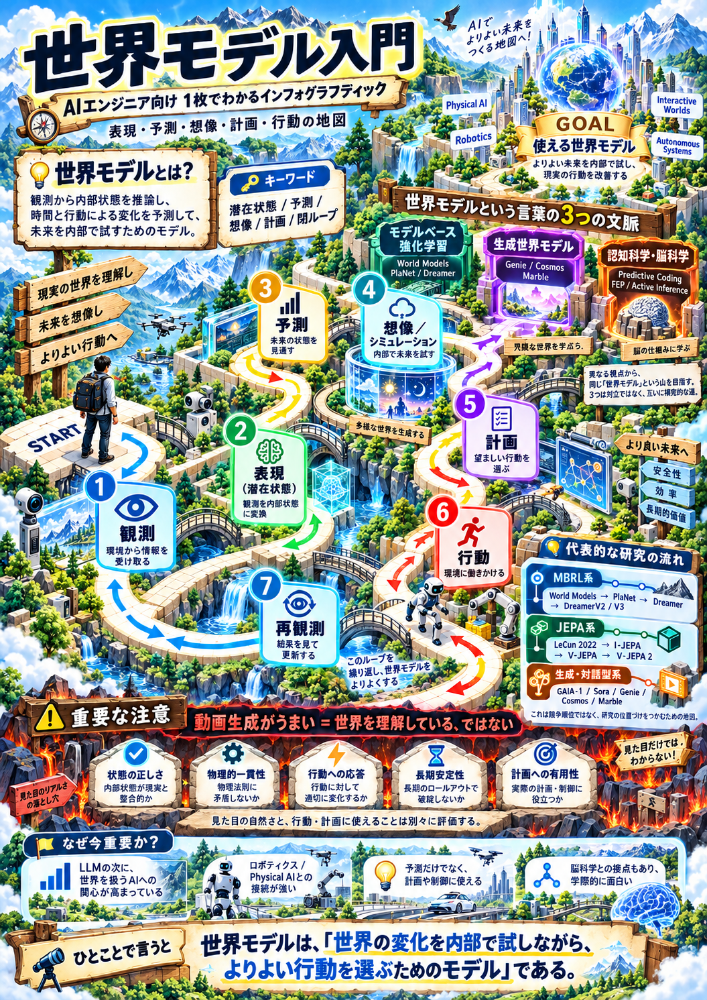

# 世界モデル

- 世界モデルは、エージェントが観測から世界の内部状態を推論し、その状態が時間や行動によってどう変わるかを予測するモデルです
- 予測した未来を内部で試すことで、現実に行動する前に候補を比較し、計画に利用できます
  - ただし、何を世界モデルと呼ぶか、どこまでの機能を要求するかは研究分野によって異なります

大規模言語モデルはテキストには強い。大規模画像モデルは画像には強い。動画も、音声も同様。ただそれらは現実世界を知っていない。

Physical AIが流行っていますが、物理つまり現実世界にAIが出ていくと現実世界を知ることが非常に弱い。そのための方法の一つが「世界モデル」であり非常に重要なのですが日本語で読める情報はとても少ない状況でした。

世界モデルについて日本語で読める解説は、これまでも論文解説、講義資料、Web記事、既存書の一章として存在していました。しかし、世界モデルそのものを主題に、研究史からDreamer・JEPA・生成型World Model、Physical AI、脳科学との接点、評価、そして実装までを一冊で横断する日本語の入門書は、著者が確認した範囲では見当たりませんでした。

日本語で「世界モデル」を体系的に学べる本が、まだほとんどない。そこで、研究史・主要アプローチ・Physical AI・脳科学・評価・実装までを約70ページに凝縮してみました。
[世界モデル入門_v0.3.pdf](世界モデル入門_v0.3.pdf)
